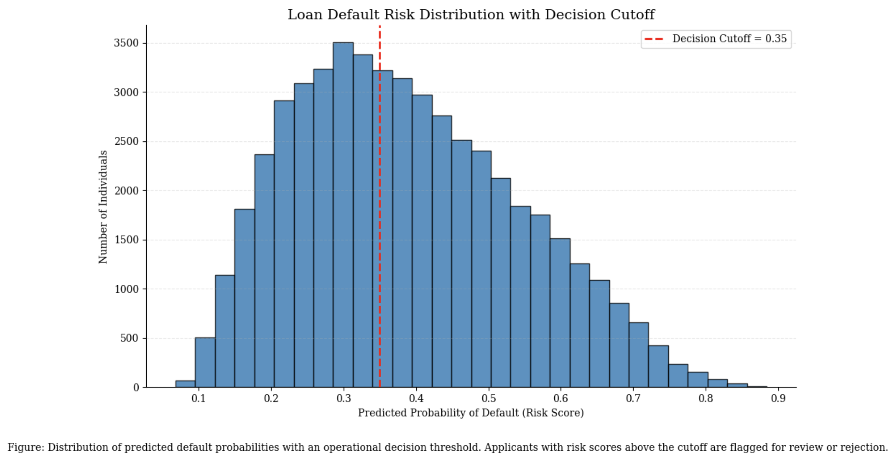
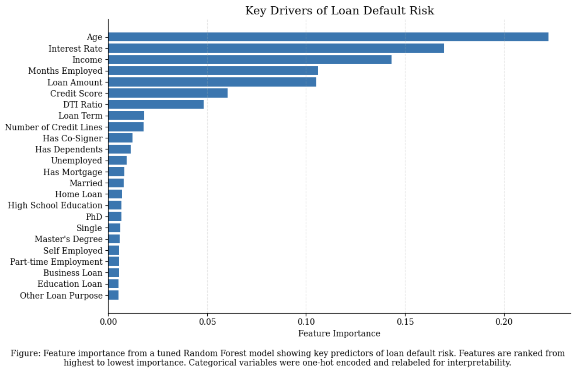
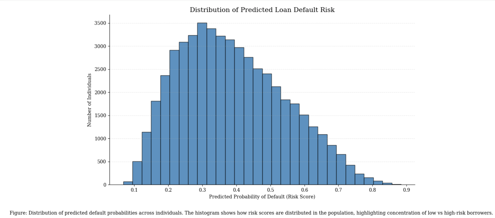

# Machine Learning-Based Credit Risk System Identifies Key Drivers of Loan Default

## Hook
Loan defaults remain a significant source of financial loss for lenders, with overexposure to high-risk borrowers often driven by incomplete or inconsistent credit evaluation methods. Traditional credit scoring systems rely on simplified thresholds that do not fully capture nonlinear relationships between borrower financial behavior and repayment outcomes. This project develops a machine learning system that improves default prediction and identifies the most important drivers of borrower risk using real financial data.

## Problem Statement
Financial institutions face persistent difficulty in accurately predicting loan default behavior using traditional credit scoring approaches. These methods often emphasize single-point metrics such as credit score or income, while ignoring interactions between variables like debt-to-income ratio, employment status, loan purpose, and credit utilization. In this dataset, features such as CreditScore, Income, DTIRatio, InterestRate, and MonthsEmployed show complex relationships with the target variable Default. The problem addressed is how to use these borrower-level attributes to build a predictive model that not only classifies default risk accurately but also reveals the most influential factors driving default outcomes.

## Solution Description
A Random Forest classification model is used to predict loan default probability for each borrower based on financial and demographic attributes including CreditScore, Income, LoanAmount, DTIRatio, EmploymentType, Education, and LoanPurpose. The model outputs a continuous risk score representing the probability of default, which is used to rank applicants from lowest to highest risk. Feature importance analysis shows that variables related to credit history, income level, and debt burden contribute most strongly to prediction performance. The system improves upon rule-based lending decisions by capturing nonlinear interactions between borrower attributes and enabling probability-based decision thresholds that can be adjusted according to lender risk tolerance.

## Visualizations
### Loan Default Risk Distribution

This visualization shows how predicted default probabilities are distributed across borrowers. Most applicants fall in the low-risk range, while a smaller subset exhibits higher risk scores. This helps lenders understand overall portfolio risk and identify how many applicants fall into different risk levels.

### Feature Importance

This plot shows the relative contribution of each feature to the model’s predictions. Credit score, income, and debt-to-income ratio are the strongest predictors, indicating that financial stability and repayment burden are the main drivers of default risk in the model.

### Decision Threshold Analysis

This visualization shows how different risk score thresholds affect lending decisions. Lower thresholds classify more borrowers as high risk, while higher thresholds increase approval rates. This allows lenders to adjust lending policy based on risk tolerance and business strategy.
